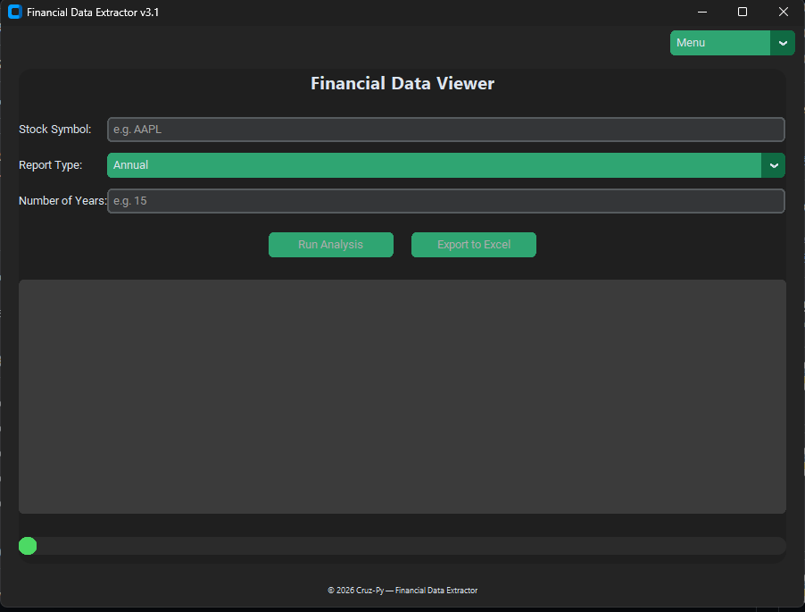

# Financial Data Extractor


A modern, user-friendly GUI tool to fetch financial statements and year-end closing prices for stocks using **Alpha Vantage** and **Yahoo Finance**, with the option to export data to Excel. Compatible with Windows and Linux.  

---

## Features
- Fetch **Income Statement**, **Balance Sheet**, and **Cash Flow** for any stock symbol.
- Retrieve **year-end closing prices** from Yahoo Finance.
- Export data to **Excel** (`.xlsx`), fully compatible with LibreOffice.
- User-friendly GUI built with **CustomTkinter**.
- Configurable **API key** settings.
- Dark mode support.
- Live **progress bar** and real-time log output.

---

## Screenshots



---

## Installation

### Prerequisites
- Python 3.10+ installed
- `pip` package manager

### Steps
1. Clone this repository:
   ```bash
   git clone https://github.com/yourusername/financial-data-extractor.git
   cd financial-data-extractor
2. Create virtual environment:
    python -m venv venv
3. Activate the veritual environment:
    For windows:
        venv\Scripts\activate
    For Linux/MacOS:
        source venv/bin/activate
4. Install dependencies:
    pip install -r requirements.txt
5. Run the app:
    python Stocks_AV_GUI_v3.py

---

## Usage
1. Open the app;
2. Click Settings;
3. Insert your Alpha Vantage API Key or request one;
4. enter a stock symbol (e.g., AAPL);
5. Select the report type (Annual or Quarter);
6. Enter the number of years (1-15);
7. Click Run Analysis;
8. Once data is fetched, click Export to Excel to save locally.

---

## About

Developed and crafter by Cruz-Py

This tool is designed for personal use or research purposes. Contributions and feedback are welcome!

### Support / Donate
If you find this tool useful, consider supporting its development:

[Donate via PayPal](https://www.paypal.me/ruicruz27)

---

## License

This project is licensed under the MIT license. See the LICENSE file for details